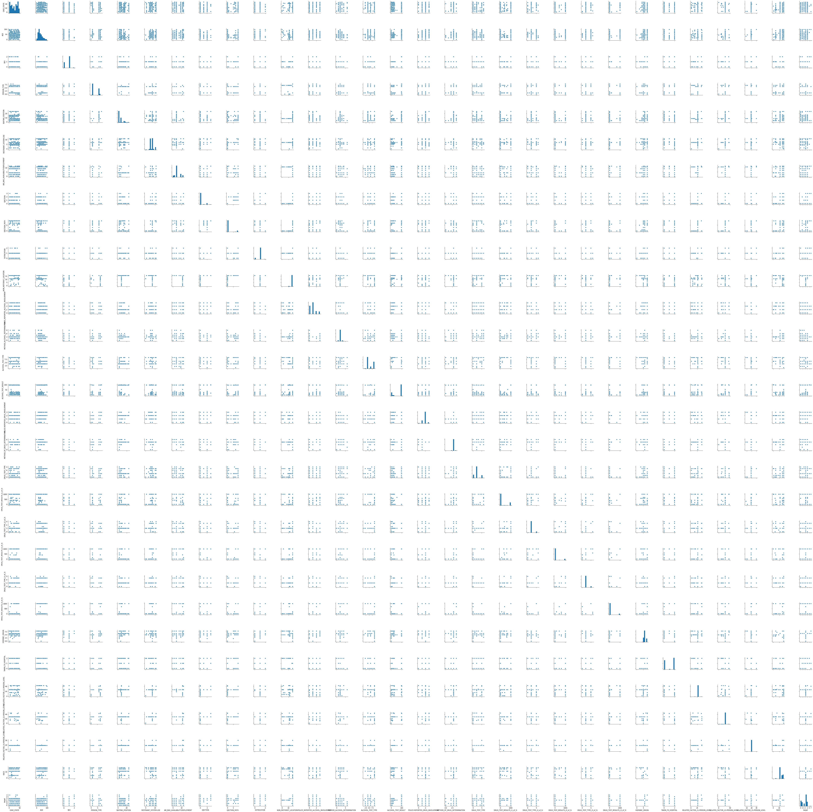

# Fatality Analysis Reporting System (FARS)

https://www.openml.org/d/40672  
Detailing the Factors Behind Traffic Fatalities on our Roads - FARS is a nationwide census providing NHTSA, Congress and the American public yearly data regarding fatal injuries suffered in motor vehicle traffic crashes.


```python
import numpy as np
import pandas as pd

from sklearn.decomposition import PCA
from sklearn.manifold import TSNE

import matplotlib.pyplot as plt
from mpl_toolkits.mplot3d import Axes3D
%matplotlib inline

import seaborn as sns
```

### Load the data from openml


```python
from sklearn.datasets import fetch_openml
fars = fetch_openml(name='fars')
```


```python
fars_pd = pd.DataFrame(fars.data, columns=fars.feature_names)
fars_pd['target'] = fars.target
```

##### What categories are available?


```python
fars_pd.columns
```


    Index(['CASE_STATE', 'AGE', 'SEX', 'PERSON_TYPE', 'SEATING_POSITION',
           'RESTRAINT_SYSTEM-USE', 'AIR_BAG_AVAILABILITY/DEPLOYMENT', 'EJECTION',
           'EJECTION_PATH', 'EXTRICATION', 'NON_MOTORIST_LOCATION',
           'POLICE_REPORTED_ALCOHOL_INVOLVEMENT', 'METHOD_ALCOHOL_DETERMINATION',
           'ALCOHOL_TEST_TYPE', 'ALCOHOL_TEST_RESULT',
           'POLICE-REPORTED_DRUG_INVOLVEMENT', 'METHOD_OF_DRUG_DETERMINATION',
           'DRUG_TEST_TYPE', 'DRUG_TEST_RESULTS_(1_of_3)',
           'DRUG_TEST_TYPE_(2_of_3)', 'DRUG_TEST_RESULTS_(2_of_3)',
           'DRUG_TEST_TYPE_(3_of_3)', 'DRUG_TEST_RESULTS_(3_of_3)',
           'HISPANIC_ORIGIN', 'TAKEN_TO_HOSPITAL',
           'RELATED_FACTOR_(1)-PERSON_LEVEL', 'RELATED_FACTOR_(2)-PERSON_LEVEL',
           'RELATED_FACTOR_(3)-PERSON_LEVEL', 'RACE', 'target'],
          dtype='object')


```python
categorie_to_color = 'target'
```

#### Have a quick look


```python
fars_pd.sample(5)
```


<div>
<style scoped>
    .dataframe tbody tr th:only-of-type {
        vertical-align: middle;
    }

    .dataframe tbody tr th {
        vertical-align: top;
    }

    .dataframe thead th {
        text-align: right;
    }
</style>
<table border="1" class="dataframe">
  <thead>
    <tr style="text-align: right;">
      <th></th>
      <th>CASE_STATE</th>
      <th>AGE</th>
      <th>SEX</th>
      <th>PERSON_TYPE</th>
      <th>SEATING_POSITION</th>
      <th>RESTRAINT_SYSTEM-USE</th>
      <th>AIR_BAG_AVAILABILITY/DEPLOYMENT</th>
      <th>EJECTION</th>
      <th>EJECTION_PATH</th>
      <th>EXTRICATION</th>
      <th>...</th>
      <th>DRUG_TEST_RESULTS_(2_of_3)</th>
      <th>DRUG_TEST_TYPE_(3_of_3)</th>
      <th>DRUG_TEST_RESULTS_(3_of_3)</th>
      <th>HISPANIC_ORIGIN</th>
      <th>TAKEN_TO_HOSPITAL</th>
      <th>RELATED_FACTOR_(1)-PERSON_LEVEL</th>
      <th>RELATED_FACTOR_(2)-PERSON_LEVEL</th>
      <th>RELATED_FACTOR_(3)-PERSON_LEVEL</th>
      <th>RACE</th>
      <th>target</th>
    </tr>
  </thead>
  <tbody>
    <tr>
      <th>24608</th>
      <td>9.0</td>
      <td>58.0</td>
      <td>0.0</td>
      <td>6.0</td>
      <td>16.0</td>
      <td>5.0</td>
      <td>4.0</td>
      <td>0.0</td>
      <td>0.0</td>
      <td>1.0</td>
      <td>...</td>
      <td>0.0</td>
      <td>2.0</td>
      <td>0.0</td>
      <td>6.0</td>
      <td>2.0</td>
      <td>27.0</td>
      <td>29.0</td>
      <td>19.0</td>
      <td>11.0</td>
      <td>2</td>
    </tr>
    <tr>
      <th>62743</th>
      <td>32.0</td>
      <td>86.0</td>
      <td>0.0</td>
      <td>7.0</td>
      <td>8.0</td>
      <td>7.0</td>
      <td>11.0</td>
      <td>0.0</td>
      <td>0.0</td>
      <td>1.0</td>
      <td>...</td>
      <td>0.0</td>
      <td>2.0</td>
      <td>0.0</td>
      <td>5.0</td>
      <td>2.0</td>
      <td>15.0</td>
      <td>29.0</td>
      <td>19.0</td>
      <td>17.0</td>
      <td>1</td>
    </tr>
    <tr>
      <th>85449</th>
      <td>43.0</td>
      <td>64.0</td>
      <td>0.0</td>
      <td>6.0</td>
      <td>6.0</td>
      <td>5.0</td>
      <td>2.0</td>
      <td>0.0</td>
      <td>0.0</td>
      <td>1.0</td>
      <td>...</td>
      <td>0.0</td>
      <td>2.0</td>
      <td>0.0</td>
      <td>6.0</td>
      <td>1.0</td>
      <td>27.0</td>
      <td>29.0</td>
      <td>19.0</td>
      <td>11.0</td>
      <td>6</td>
    </tr>
    <tr>
      <th>63398</th>
      <td>32.0</td>
      <td>84.0</td>
      <td>1.0</td>
      <td>1.0</td>
      <td>3.0</td>
      <td>5.0</td>
      <td>2.0</td>
      <td>0.0</td>
      <td>0.0</td>
      <td>1.0</td>
      <td>...</td>
      <td>0.0</td>
      <td>2.0</td>
      <td>0.0</td>
      <td>6.0</td>
      <td>0.0</td>
      <td>27.0</td>
      <td>29.0</td>
      <td>19.0</td>
      <td>11.0</td>
      <td>4</td>
    </tr>
    <tr>
      <th>95416</th>
      <td>46.0</td>
      <td>68.0</td>
      <td>0.0</td>
      <td>6.0</td>
      <td>6.0</td>
      <td>5.0</td>
      <td>4.0</td>
      <td>0.0</td>
      <td>0.0</td>
      <td>1.0</td>
      <td>...</td>
      <td>0.0</td>
      <td>2.0</td>
      <td>0.0</td>
      <td>6.0</td>
      <td>2.0</td>
      <td>27.0</td>
      <td>29.0</td>
      <td>19.0</td>
      <td>11.0</td>
      <td>6</td>
    </tr>
  </tbody>
</table>
<p>5 rows × 30 columns</p>
</div>


```python
sns.pairplot(fars_pd.sample(1000))
```


    <seaborn.axisgrid.PairGrid at 0x7f9414112908>





### Let's try PCA (Principal Component Analysis) first

normally that works quite good for low dimensional data

### We gonna try 2d and 3d visualization


```python
#3d
pca3d = PCA(n_components=3)
result3d = pca3d.fit_transform(fars_pd.drop(categorie_to_color, axis=1),fars_pd[categorie_to_color])
results3d_pd = pd.DataFrame(result3d,columns=['x','y','z'])
results3d_pd[categorie_to_color] = fars_pd[categorie_to_color].astype('int')
```


```python
#2d
pca2d = PCA(n_components=2)
result2d = pca2d.fit_transform(fars_pd.drop(categorie_to_color, axis=1),fars_pd[categorie_to_color])
results2d_pd = pd.DataFrame(result2d,columns=['x','y'])
results2d_pd[categorie_to_color] = fars_pd[categorie_to_color].astype('int')
```

### Let's plot


```python
fig_pca = plt.figure(figsize=(20,10))
ax = fig_pca.add_subplot(121, projection='3d')
ax.scatter(results3d_pd['x'], results3d_pd['y'], results3d_pd['z'],c=results3d_pd[categorie_to_color],  alpha=0.5)
ax.set_xlabel('X')
ax.set_ylabel('Y')
ax.set_zlabel('Z')
ax.set_title("3d PCA")
ax.title
ax2 = fig_pca.add_subplot(122)
ax2.scatter(results2d_pd['x'], results2d_pd['y'],c=results3d_pd[categorie_to_color], alpha=0.5)
ax2.set_xlabel('X')
ax2.set_ylabel('Y')
ax2.set_title("2d PCA")

fig_pca.suptitle("Comparison between 2d and 3d PCA \n Components-Ratio for 3d {}, Compenents-Ratio for 2d {}".format(pca2d.explained_variance_ratio_,pca3d.explained_variance_ratio_))
plt.show()
```


#### not too impressive ... tsne should do better


```python
sample_ds = fars_pd.sample(3000)
sample_ds = sample_ds.reset_index().drop("index",axis=1)
tsne = TSNE(n_components=2, verbose=1, perplexity=35, n_iter=5000,learning_rate=200 )
tsne_results = tsne.fit_transform(sample_ds)
tsne_results_pd = pd.DataFrame(tsne_results,columns=['x','y'])
tsne_results_pd[categorie_to_color] = sample_ds[categorie_to_color].astype('int')
```

    [t-SNE] Computing 106 nearest neighbors...
    [t-SNE] Indexed 3000 samples in 0.012s...
    [t-SNE] Computed neighbors for 3000 samples in 0.221s...
    [t-SNE] Computed conditional probabilities for sample 1000 / 3000
    [t-SNE] Computed conditional probabilities for sample 2000 / 3000
    [t-SNE] Computed conditional probabilities for sample 3000 / 3000
    [t-SNE] Mean sigma: 6.079796
    [t-SNE] KL divergence after 250 iterations with early exaggeration: 61.106724
    [t-SNE] KL divergence after 5000 iterations: 0.639076


```python
sample_ds_3d = fars_pd.sample(3000)
sample_ds_3d = sample_ds_3d.reset_index().drop("index",axis=1)
tsne3d = TSNE(n_components=3, verbose=1, perplexity=45, n_iter=2500,learning_rate=200,)
tsne_results3d = tsne3d.fit_transform(sample_ds_3d)
tsne_results_pd3d = pd.DataFrame(tsne_results3d,columns=['x','y','z'])
tsne_results_pd3d[categorie_to_color] = sample_ds_3d[categorie_to_color].astype('int')
```

    [t-SNE] Computing 136 nearest neighbors...
    [t-SNE] Indexed 3000 samples in 0.012s...
    [t-SNE] Computed neighbors for 3000 samples in 0.238s...
    [t-SNE] Computed conditional probabilities for sample 1000 / 3000
    [t-SNE] Computed conditional probabilities for sample 2000 / 3000
    [t-SNE] Computed conditional probabilities for sample 3000 / 3000
    [t-SNE] Mean sigma: 6.154976
    [t-SNE] KL divergence after 250 iterations with early exaggeration: 59.286453
    [t-SNE] KL divergence after 2500 iterations: 0.478998


```python
fig_tsne = plt.figure(figsize=(20,10))
ax3 = fig_tsne.add_subplot(121)
im = ax3.scatter(tsne_results_pd['x'], tsne_results_pd['y'],c=tsne_results_pd[categorie_to_color],alpha=0.3, cmap=plt.cm.tab10_r)
ax3.set_xlabel('X')
ax3.set_ylabel('Y')
ax3.set_title("2d tSNE")
fig_tsne.colorbar(im, orientation="horizontal", pad=0.2)

ax4 = fig_tsne.add_subplot(122, projection='3d')
im2 = ax4.scatter(tsne_results_pd3d['x'], tsne_results_pd3d['y'],tsne_results_pd3d['z'],c=tsne_results_pd3d[categorie_to_color],alpha=0.3, cmap=plt.cm.tab10_r)
ax4.set_xlabel('X')
ax4.set_ylabel('Y')
ax4.set_zlabel('Z')
ax4.set_title("3d tSNE")


fig_tsne.colorbar(im2, orientation="horizontal", pad=0.2)

# cbaxes = fig_tsne.add_axes([0.8, 0.1, 0.03, 0.8]) 
# fig_tsne.colorbar(im2, cax=cbaxes)
plt.show()
```


## Accelerate with CUDA/RAPIDS and use all the data

### This part of the code needs a NVIDIA P100 or T4 and at least rapids 0.9


```python
import cudf
import cuml
from cuml.manifold import TSNE as TSNE_CUDA
```


```python
tsne_cuda = TSNE_CUDA(n_components=2, verbose=1, perplexity=35, n_iter=5000,learning_rate=200 )
```


```python
tsne_results_c = tsne_cuda.fit_transform(cudf.DataFrame.from_pandas(fars_pd))
tsne_results_c = cudf.DataFrame.to_pandas(tsne_results_c)
```

    Learning rate is adaptive. In TSNE paper, it has been shown that as n->inf, Barnes Hut works well if n_neighbors->30, learning_rate->20000, early_exaggeration->24.
    cuML uses an adpative method.n_neighbors decreases to 30 as n->inf. Likewise for the other params.
    New n_neighbors = 30, learning_rate = 33656.0, exaggeration = 24.0


```python
tsne_results_c.columns=['x','y']
```


```python
fig_tsne_c = plt.figure(figsize=(20,20))

plt.scatter(tsne_results_c['x'], tsne_results_c['y'],c=fars_pd[categorie_to_color].astype('int'),alpha=0.3, cmap=plt.cm.tab10_r)
```


    <matplotlib.collections.PathCollection at 0x7f941790a630>


```python

```
